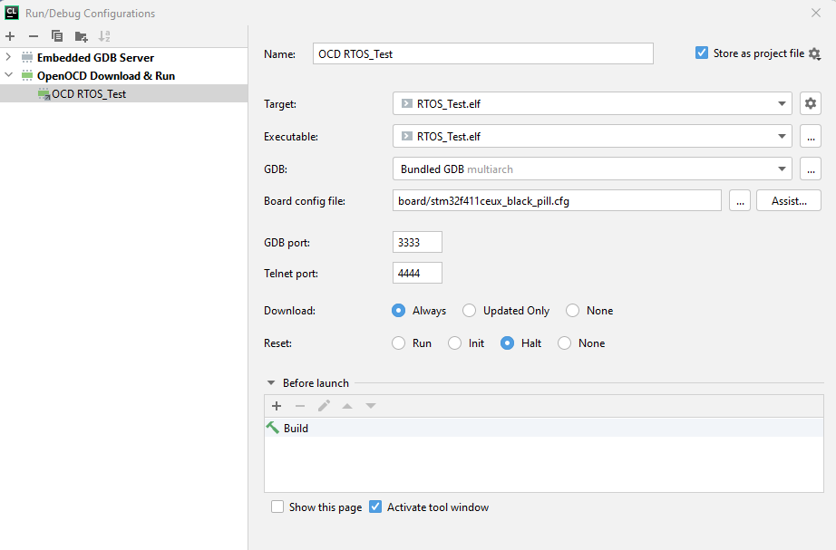

# ITM Viewer

ITM Viewer allows you to view the messages sent through the ARM ITM data channels.

*The plugin is at the start of the development and some things may not work as stable as planned, so please use it with patience :)*


## Getting Started

This plugin parses the TCL RPC Server output of OpenOCD. In order to activate it you must activate the tcl server.

### Prerequisites

* OpenOCD
* CLion

### OpenOCD Configurations

***Note:*** OpenOCD has to be configured with the Board's CPU clock. Make sure that the OpenOCD config matches the clock
in this line `tpiu config internal - uart off ${clock in Hz}`, otherwise it won't work.

| Board                                                                       | OpenOCD Configuration                               |
|-----------------------------------------------------------------------------|-----------------------------------------------------|
| [STM32F746NG](https://www.st.com/en/evaluation-tools/32f746gdiscovery.html) | [stm32f7.cfg](./doc/configurations/stm32f7.cfg)     |
| STM32F411CUX ("blackpill")                                                  | [stm32f411.cfg](./doc/configurations/stm32f411.cfg) |

And for the corresponding configuration in the CLion plugin config:


### Example

A minimal C example to send message via ITM (for STM32F746):

```c
#define LOG_DEBUG_LEVEL 24
#define LOG_INFO_LEVEL 25
#define LOG_WARN_LEVEL 26
#define LOG_ERROR_LEVEL 27

#define LOG_DEBUG(msg) println(msg, LOG_DEBUG_LEVEL)
#define LOG_INFO(msg) println(msg, LOG_INFO_LEVEL)
#define LOG_WARN(msg) println(msg, LOG_WARN_LEVEL)
#define LOG_ERROR(msg) println(msg, LOG_ERROR_LEVEL)

void print(char _char, uint8_t level) {
    while (ITM->PORT[level].u32 == 0UL) {
        __NOP();
    }
    ITM->PORT[level].u8 = (uint8_t) _char;
}

void println(const char* msg, uint8_t level) {
    if(msg == NULL || level > 31) {
        return;
    }
    for(int i = 0; i<strlen(msg); i++) {
        print(msg[i], level);
    }
    print('\n', level);
}

void itm_test(void *pvParameters) {
    while(1) {
        LOG_INFO("Hello World!");
        vTaskDelay(1000); // or HAL_Delay
    }
}
```

### Installing

#### JetBrains Plugin Repository

ITM Viewer is available in the JetBrains Plugin Repository https://plugins.jetbrains.com/plugin/14163-itm-viewer.

#### Manual

The plugin uses the jetbrains gradle plugin template. In order to build it you have to pull the dependencies and build
the release version:

`gradle buildPlugin`

After project build:

- Copy from `<Project root>/build/libs/itm_viewer-1.2.0.jar`
- To `<Clion instalation folder>/plugins/itm-viewer` folder
- Then open IDE: Settings -> Plugins -> enable plugin
- 

#### Run configuration



## Authors

* **Mohamad Ramadan** - [ramdadam](https://github.com/ramdadam)

## Contributors
* [ximtech](https://github.com/ximtech)
* [pperle](https://github.com/pperle)

Thanks for the awesome work with [cmake-conan](https://github.com/conan-io/cmake-conan) that helped me get started.

Also big thanks to my colleagues at cosee for helping me out with the Java stuff :)

## License

This project is licensed under the MIT License - see the [License](License) file for details
